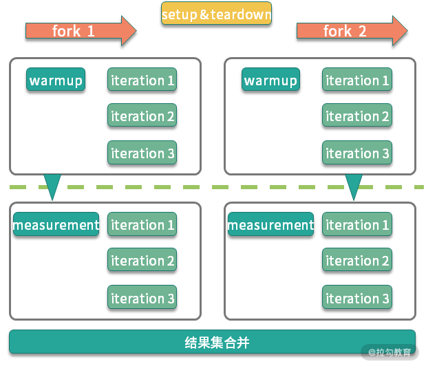
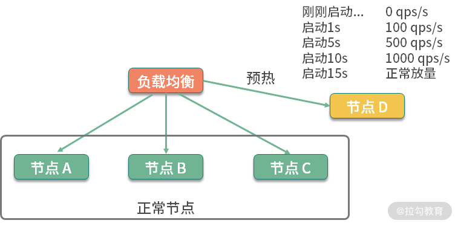

场景：日常开发中，经常会写一些统计执行时间的代码，穿插在代码逻辑中，进行一些简单的计时运算，比如下面这几行:

 ```java 
long start = System.currentTimeMillis();
//logic
long cost = System.currentTimeMillis() - start;
System.out.

println("Logic cost : "+cost);
```

问题：

1. 统计结果不准确，JVM在执行时，会对一些代码块，或者频繁执行的逻辑进行JIT编译和内联优化，在得到一个稳定的测试结果之前，需要先循环上万次进行预热。
   预热前和预热后的性能差别非常大。
2. 评估性能有很多的指标，如果这些指标数据，每次都通过手工去算的话，肯定是枯燥乏味且低效的

## JMH —— 基准测试工具

**特点**：

- 测量精度非常高，可达纳秒级别

JMH在JDK12中被包含，其他版本需要自行引入maven，坐标如下

```xml

<dependencies>
    <dependency>
        <groupId>org.openjdk.jmh</groupId>
        <artifactId>jmh-core</artifactId>
        <version>1.23</version>
    </dependency>
    <dependency>
        <groupId>org.openjdk.jmh</groupId>
        <artifactId>jmh-generator-annprocess</artifactId>
        <version>1.23</version>
        <scope>provided</scope>
    </dependency>
</dependencies>
```

**使用**
JMH 是一个 jar 包，它和单元测试框架 JUnit 非常像，可以通过注解进行一些基础配置。这部分配置有很多是可以通过 main 方法的
OptionsBuilder 进行设置的。


上图是一个典型的 JMH 程序执行的内容。通过开启多个进程，多个线程，先执行预热，然后执行迭代，最后汇总所有的测试数据进行分析。在执行前后，还可以根据粒
度处理一些前置和后置操作。

一段简单的JMH代码如下所示：

```java

@BenchmarkMode(Mode.Throughput)
@OutputTimeUnit(TimeUnit.MILLISECONDS)
@State(Scope.Thread)
@Warmup(iterations = 3, time = 1, timeUnit = TimeUnit.SECONDS)
@Measurement(iterations = 5, time = 1, timeUnit = TimeUnit.SECONDS)
@Fork(1)
@Threads(2)
public class BenchmarkTest {
    @Benchmark
    public long shift() {
        long t = 455565655225562L;
        long a = 0;
        for (int i = 0; i < 1000; i++) {
            a = t >> 30;
        }
        return a;
    }

    @Benchmark
    public long div() {
        long t = 455565655225562L;
        long a = 0;
        for (int i = 0; i < 1000; i++) {
            a = t / 1024 / 1024 / 1024;
        }
        return a;
    }

    public static void main(String[] args) throws Exception {
        Options opts = new OptionsBuilder()
                .include(BenchmarkTest.class.getSimpleName())
                .resultFormat(ResultFormatType.JSON)
                .build();
        new Runner(opts).run();
    }
}
```

## 关键注解

### 1.@Warmup

样例如下：

```java
@Warmup(
        iterations = 5,
        time = 1,
        timeUnit = TimeUnit.SECONDS)
```

我们不止一次提到预热 warmup 这个注解，可以用在类或者方法上，进行预热配置。可以看到，它有几个配置参数：

- timeUnit：时间的单位，默认的单位是秒；
- iterations：预热阶段的迭代数；
- time：每次预热的时间；
- batchSize：批处理大小，指定了每次操作调用几次方法。

上面的注解，意思是对代码预热总计 5 秒（迭代 5 次，每次一秒）。预热过程的测试数据，是不记录测量结果的。

我们可以看一下它执行的效果：

```shell
# Warmup: 3 iterations, 1 s each 
# Warmup Iteration   1: 0.281 ops/ns 
# Warmup Iteration   2: 0.376 ops/ns 
# Warmup Iteration   3: 0.483 ops/ns
```

一般来说，基准测试都是针对比较小的、执行速度相对较快的代码块，这些代码有很大的可能性被 JIT 编译、内联，所以在编码时保持方法的精简，是一个好的习惯。
具体优化过程，我们将在 18 课时介绍。

说到预热，就不得不提一下在分布式环境下的服务预热。在对服务节点进行发布的时候，通常也会有预热过程，逐步放量到相应的服务节点，直到服务达到最优状态。
如下图所示，负载均衡负责这个放量过程，一般是根据百分比进行放量。



### 2.@Measurement

### 3.@BenchmarkMode

### 4.@Fork

### 5.@Threads

### 6.@Group

### 7.@State

### 8.@Setup和@TearDown

### 9.@Param

### 10.@CompilerControl

## 将结果图形化

### 1.JMH支持5种格式结果

- TEXT 导出文本文件。
- CSV 导出 csv 格式文件。
- SCSV 导出 scsv 等格式的文件。
- JSON 导出成 json 文件。
- LATEX 导出到 latex，一种基于 ΤΕΧ 的排版系统。

### 2.结果图形化制图工具

## 小结

本课时主要介绍了 基准测试工具— JMH，官方的 JMH 有非常丰富的示例，比如伪共享（FalseSharing）的影响等高级话题。我已经把它放在了
Gitee
（点击链接跳转）上，你可以将其导入至 Idea 编辑器进行测试。

JMH 这个工具非常好用，它可以使用确切的测试数据，来支持我们的分析结果。一般情况下，如果定位到热点代码，就需要使用基准测试工具进行专项优化，直到性能有了显著的提升。

接下来的课程，将涉及对一些性能问题细节的验证，也会使用 JMH 进行进一步的分析。