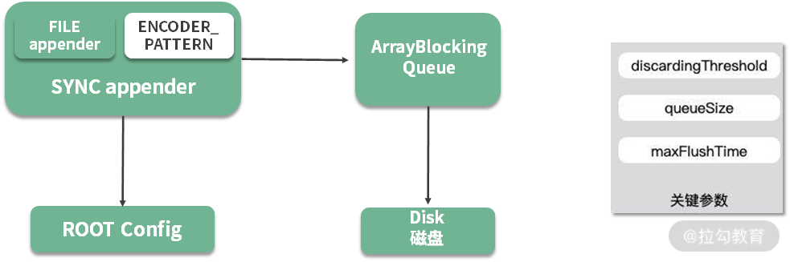

## 深入理解缓冲的本质

缓冲（Buffer）通过对数据进行暂存，然后批量进行传输或者操作，多采用顺序方式，来缓解不同设备之间次数频繁但速度缓慢的随机读写。

缓冲区的好处：

- 缓冲双方能各自保持自己的操作节奏，操作处理顺序也不会打乱，可以 one by one 顺序进行；
- 以批量的方式处理，减少网络交互和繁重的 I/O 操作，从而减少性能损耗；
- 优化用户体验，比如常见的音频/视频缓冲加载，通过提前缓冲数据，达到流畅的播放效果。

缓冲在Java语言中被广泛应用，最典型的就是**文件读取和写入字符流**

## 文件读写流

Java的I/O流设计，采用的是**装饰器模式**，当需要给类添加新的功能时，就可以将被装饰者通过参数传递到装饰者，封装成新的功能方法。

## 日志缓冲

SLF4J 是 Java 里标准的日志记录库，它是一个允许你使用任何 Java 日志记录库的抽象适配层，最常用的实现是 Logback，支持修改后自动
reload，它比
Java 自带的 JUL 还要流行。

Logback 性能也很高，其中一个原因就是异步日志，它在记录日志时，使用了一个缓冲队列，当缓冲的内容达到一定的阈值时，才会把缓冲区的内容写到文件里。
使用异步日志有两个考虑：

- 同步日志的写入，会阻塞业务，导致服务接口的耗时增加；
- 日志写入磁盘的代价是昂贵的，如果每产生一条日志就写入一次，CPU 会花很多时间在磁盘 I/O 上。

```xml
<appender name ="ASYNC" class= "ch.qos.logback.classic.AsyncAppender"> 
        <discardingThreshold >0</discardingThreshold> 
        <queueSize>512</queueSize> 
        <!--这里指定了一个已有的Appender--> 
        <appender-ref ref ="FILE"/> 
</appender>
```



如上图，异步日志输出之后，日志信息将暂存在 ArrayBlockingQueue 列表中，后台会有一个 Worker 线程不断地获取缓冲区内容，然后写入磁盘中。

上图中有三个关键参数：

- queueSize，代表了队列的大小，默认是256。如果这个值设置的太大，大日志量下突然断电，会丢掉缓冲区的内容；
- maxFlushTime，关闭日志上下文后，继续执行写任务的时间，这是通过调用 Thread 类的 join 方法来实现的（worker.join(
  maxFlushTime)）；
- discardingThreshold，当 queueSize 快达到上限时，可以通过配置，丢弃一些级别比较低的日志，这个值默认是队列长度的
  80%；但若你担心可能会丢失业
- 务日志，则可以将这个值设置成 0，表示所有的日志都要打印。

## 缓冲区优化思路

毫无疑问缓冲区是可以提高性能的，但它通常会引入一个异步的问题，使得编程模型变复杂。

### 1.同步操作

控制缓冲区大小，并把握处理的时机，比如，当缓冲区大小达到阈值，或者缓冲区的元素在缓冲区的停留时间超时，这时就会触发批量操作。

由于所有的操作都在单线程，或者同步方法块中完成，再加上资源B的处理能力有限，很多操作就会阻塞并等待在调用线程上。比如写文件时，需要等待前面的数据写入
完毕，才能处理后面的请求。

### 2.异步操作

缓冲区的生产者一般是同步调用，但也可以采用异步方式进行填充，一旦采用异步操作，就涉及缓冲区满了以后，生产者的一些响应策略。

此时，应该将这些策略抽象出来，根据业务的属性选择，比如直接抛弃、抛出异常，或者直接在用户的线程进行等待。你会发现它与线程池的饱和策略是类似的，这部分
的详细概念将在 12 课时讲解。

许多应用系统还会有更复杂的策略，比如在用户线程等待，设置一个超时时间，以及成功进入缓冲区之后的回调函数等。

对缓冲区的消费，一般采用开启线程的方式，如果有多个线程消费缓冲区，还会存在信息同步和顺序问题。

### 3.Kafka缓冲区示例

**Kafka的生产者，有可能会丢数据吗？**

### 4.其他做法

使用缓冲区来提升性能的做法非常多，下面再举几个例子：

- StringBuilder 和 StringBuffer，通过将要处理的字符串缓冲起来，最后完成拼接，提高字符串拼接的性能；
- 操作系统在写入磁盘，或者网络 I/O 时，会开启特定的缓冲区，来提升信息流转的效率。通常可使用 flush 函数强制刷新数据，比如通过调整
  Socket 的参数
- SO_SNDBUF 和 SO_RCVBUF 提高网络传输性能；
- MySQL 的 InnoDB 引擎，通过配置合理的 innodb_buffer_pool_size，减少换页，增加数据库的性能；
- 在一些比较底层的工具中，也会变相地用到缓冲。比如常见的 ID 生成器，使用方通过缓冲一部分 ID 段，就可以避免频繁、耗时的交互。

### 5.注意事项

缓冲区帮助提高应用程序的性能同时，产生的异常情况：

1. 缓冲区内容的丢失：即使你使用 addShutdownHook 做了优雅关闭，有些情形依旧难以防范避免，比如机器突然间断电，应用程序进程突然死亡等。这时，缓冲区
   内未处理完的信息便会丢失，尤其金融信息，电商订单信息的丢失都是比较严重的。

2. 内容写入缓冲区之前，需要预先写日志：故障后重启时，就会根据这些日志进行数据恢复。在数据库领域，文件缓冲的场景非常多，一般都是采用
   WAL 日志（Write-Ahead Logging）解决。对数据完整性比较严格的系统，甚至会通过电池或者 UPS 来保证缓冲区的落地。这就是性能优化带来的新问题，必须要解决。

## 小结

可以看到，缓冲区优化是对正常的业务流程进行截断，然后加入缓冲组件的一个操作，它分为同步和异步方式，其中异步方式的实现难度相对更高。

大多数组件，从操作系统到数据库，从 Java 的 API 到一些中间件，都可以通过设置一些参数，来控制缓冲区大小，从而取得较大的性能提升。但需要注意的是，
某些极端场景（断电、异常退出、kill -9等）可能会造成数据丢失，若你的业务对此容忍度较低，那么你需要花更多精力来应对这些异常。

在我们面试的时候，除了考察大家对知识细节的掌握程度，还会考察总结能力，以及遇到相似问题的分析能力。大家在平常的工作中，也要多多总结，多多思考，
窥一斑而知全貌。如此回答，必会让面试官眼前一亮。