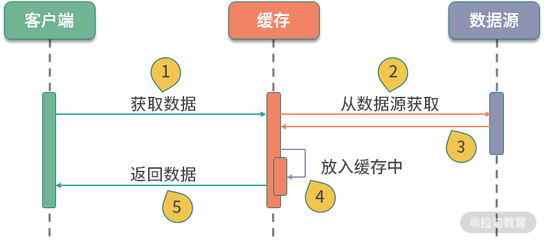

**缓存**，**本质**上是为了协调连个速度差异非常大的组件，通过加入一个中间层，将常用的数据存放在相对高速的设备中。

在我们平常的应用开发中，根据缓存所处的物理位置，一般分为**进程内**缓存和**进程外**缓存。

本课时我们主要聚焦在进程内缓存上，在 Java 中，进程内缓存，就是我们常说的**堆内缓存**。Spring 的默认实现里，就包含
Ehcache、JCache、Caffeine、
Guava Cache 等。

## Guava的LoadingCache

Guava 是一个常用的工具包，其中的 **LoadingCache**（下面简称 LC），是非常好用的**堆内缓存工具**。通过学习 LC
的结构，即可了解堆内缓存设计的一般思路。

缓存一般是比较昂贵的组件，容量是有限制的，设置得过小，或者过大，都会影响缓存性能：

- 缓存空间过小，就会造成高命中率的元素被频繁移出，失去了缓存的意义；
- 缓存空间过大，不仅浪费宝贵的缓存资源，还会对垃圾回收产生一定的压力。

### 1.缓存初始化

首先，我们可以通过下面的参数设置一下 LC 的大小。一般，我们只需给缓存提供一个上限。

- maximumSize 这个参数用来设置缓存池的最大容量，达到此容量将会清理其他元素；
- initialCapacity 默认值是 16，表示初始化大小；
- concurrencyLevel 默认值是 4，和初始化大小配合使用，表示会将缓存的内存划分成 4 个 segment，用来支持高并发的存取。

### 2.缓存操作

那么缓存数据是怎么放进去的呢？有两种模式：

- 使用 put 方法手动处理，比如，我从数据库里查询出一个 User 对象，然后手动调用代码进去；
- 主动触发（ 这也是 Loading 这个词的由来），通过提供一个 CacheLoader 的实现，就可以在用到这个对象的时候，进行延迟加载。

```java
public static void main(String[] args) {
    LoadingCache<String, String> lc = CacheBuilder
            .newBuilder()
            .build(new CacheLoader<String, String>() {
                @Override
                public String load(String key) throws Exception {
                    return slowMethod(key);
                }
            });
}

static String slowMethod(String key) throws Exception {
    Thread.sleep(1000);
    return key + ".result";
}
```

上面是主动触发的示例代码，你可以使用 get 方法获取缓存的值。比如，当我们执行 lc.get(“a”) 时，第一次会比较缓慢，因为它需要到数据源进行获取；
第二次就瞬间返回了，也就是缓存命中了。具体时序可以参见下面这张图。


除了靠 LC 自带的回收策略，我们也可以手动删除某一个元素，这就是 invalidate 方法。当然，数据的这些删除操作，也是可以监听到的，只需要设置一个监听器
就可以了，代码如下：

```java
.removalListener(notification ->System.out.

println(notification))
```

### 3.回收策略

1. 基于容量
2. 基于时间
3. 基于JVM垃圾回收

### 4.缓存造成内存故障

值得注意的是：LC 是基于数据条数而不是基于缓存物理大小的，所以如果你缓存的对象特别大，就会造成不可预料的内存占用。

## 缓存算法

### 1.算法介绍

- FIFO
- LRU
- LFU

### 2.实现一个LRU算法

## 进一步加速

在文件读取的缓存方面，操作系统做得更多。由于磁盘擅长顺序读写，在随机读写的时候，效率很低，所以，操作系统使用了智能的预读算法（readahead），
将数据从硬盘中加载到缓存中。

预读算法有三个关键点：

- 预测性，能够根据应用的使用数据，提前预测应用后续的操作目标；
- 提前，能够将这些数据提前加载到缓存中，保证命中率；
- 批量，将小块的、频繁的读取操作，合并成顺序的批量读取，提高性能。

## 缓存优化的一般思路

一般，缓存针对的主要是读操作。当你的功能遇到下面的场景时，就可以选择使用缓存组件进行性能优化：

- 存在数据热点，缓存的数据能够被频繁使用；
- 读操作明显比写操作要多；
- 下游功能存在着比较悬殊的性能差异，下游服务能力有限；
- 加入缓存以后，不会影响程序的正确性，或者引入不可预料的复杂性。
-

缓存组件和缓冲类似，也是在两个组件速度严重不匹配的时候，引入的一个中间层，但它们服务的目标是不同的：

- 缓冲，数据一般只使用一次，等待缓冲区满了，就执行 flush 操作；
- 缓存，数据被载入之后，可以多次使用，数据将会共享多次。

**缓存最重要的指标就是命中率**，有以下几个因素会影响命中率。

（1）缓存容量

缓存的容量总是有限制的，所以就存在一些冷数据的逐出问题。但缓存也不是越大越好，它不能明显挤占业务的内存。

（2）数据集类型

如果缓存的数据是非热点数据，或者是操作几次就不再使用的冷数据，那命中率肯定会低，缓存也会失去了它的作用。

（3）缓存失效策略

缓存算法也会影响命中率和性能，目前效率最高的算法是 Caffeine 使用的 W-TinyLFU 算法，它的命中率非常高，内存占用也更小。新版本的
spring-cache，已经默认支持 Caffeine。

## 小结

最后，我来总结一下本课时的知识要点。

我们先以 Guava 的 LoadingCache 为例，讲解了堆内缓存设计的一些思路；同时，介绍了一个因为缓存不合理利用所造成的内存故障，这些都是面试中的高频问题；
然后又讲解了，三个常用的缓存算法 LRU、LFU、FIFO，并以 LinkedHashMap 为基础，实现了一个最简单的 LRU 缓存。

本课时还提到了使用预读或者提前载入等方式，来进一步加速应用的方法，readahead技术，在操作系统、数据库中使用非常多，性能提升也比较显著。

最后，我们提到可以通过利用缓存框架的一些监控数据，来调整缓存的命中率，要达到50% 的命中率才算有较好的效果。

接下来，我再简单举两个缓存应用的例子。

- 第一个是 HTTP 304 状态码，它是 Not Modified 的意思。 浏览器客户端会发送一个条件性的请求，服务端可以通过 If-Modified-Since
  头信息判断缓冲的
  文件是否是最新的。如果是，那么客户端就直接使用缓存，不用进行再读取了。
- 另一个是关于 CDN，这是一种变相的缓存。 用户会从离它最近最快的节点，读取文件内容。如果这个节点没有缓存这个文件，那么 CDN
  节点就会从源站拉取一份，下
  次有相同的读取请求时，就可以快速返回。
  缓存的应用非常广泛，大家在平常的工作中，也可以尝试进行总结、类比