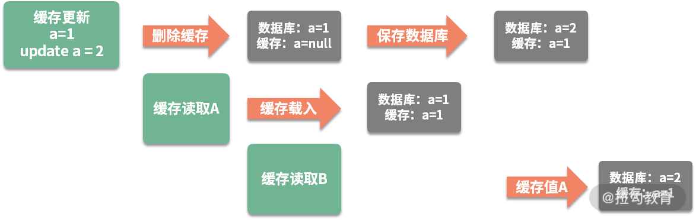

## 秒杀业务介绍

@startmindmap

* 秒杀业务特点
  ** 突发性
  *** 流量突发
  *** 数据热点
  ** 数据一致性
  *** 锁冲突严重
  *** 数据同步
  ** 基础设施
  *** 组件多
  *** 技术难度高
  @endmindmap

处理秒杀业务有三个绝招：

- 第一，选择速度最快的内存作为数据写入；
- 第二，使用异步处理代替同步请求；
- 第三，使用分布式横向扩展。

## 缓存穿透、击穿和雪崩

### 1.缓存穿透

本次请求，在缓存和持久层都没有命中，这种情况就叫缓存的穿透。

第一种：就是把空对象缓存起来。不是持久层查不到数据吗？那么我们就可以把本次请求的结果设置为
null，然后放入到缓存中。通过设置合理的过期时间，就可以保证后端数据库的安全。

第二种布隆过滤器：缓存空对象会占用额外的缓存空间，还会有数据不一致的时间窗口，所以第二种方法就是针对大数据量的、有规律的键值，使用布隆过滤器进行处理。

一条记录存在与不存在，是一个 Bool 值，只需要使用 1 比特就可存储。布隆过滤器就可以把这种是、否操作，压缩到一个数据结构中。比如手机号，用户性别这种数据，就非常适合使用布隆过滤器。

### 2.缓存击穿

缓存击穿，指的也是用户请求落在数据库上的情况，大多数情况，是由于缓存时间批量过期引起的。

对于比较热点的数据，我们就可以设置它不过期；或者在访问的时候，更新它的过期时间；批量入库的缓存项，也尽量分配一个比较平均的过期时间，避免同一时间失效。

### 3.缓存雪崩

当缓存系统出现故障，流量会瞬间转移到后端的数据库。过不了多久，数据库将会被大流量压垮挂掉，这种级联式的服务故障，可以形象地称为雪崩。

缓存的高可用建设是非常重要的。Redis 提供了主从和 Cluster 的模式，其中 Cluster 模式使用简单，每个分片也能单独做主从，可以保证极高的可用性。

另外，我们对数据库的性能瓶颈有一个大体的评估。如果缓存系统down掉，那么流向数据库的请求，就可以使用**限流组件**，将请求拦截在外面

## 缓存一致性

对于一个缓存项来说，常用的操作有四个：**写入、更新、读取、删除**。

- **写入**：缓存和数据库是两个不同的组件，只要涉及双写，就存在只有一个写成功的可能性，造成数据不一致。
- **更新**：更新的情况类似，需要更新两个不同的组件。
- **读取**：读取要保证从缓存中读到的信息是最新的，是和数据库中的是一致的。
- **删除**：当删除数据库记录的时候，如何把缓存中的数据也删掉？

触发式的缓存一致性方式，使用懒加载，让缓存的同步变得简单：

- 当读取缓存的时候，如果缓存里没有相关数据，则执行相关的业务逻辑，构造缓存数据存入到缓存系统；
- 当与缓存项相关的资源有变动，则先删除相应的缓存项，然后再对资源进行更新，这个时候，即使是资源更新失败，也是没有问题的。

缓存删除和数据库更新操作不在一个事务导致的数据不一致：

解决方案：分布式锁，将缓存操作和数据库删除操作，与其他的缓存读操作，使用锁进行资源隔离即可。一般来说，读操作是不需要加锁的，它会在遇到锁的时候，
重试等待，直到超时。