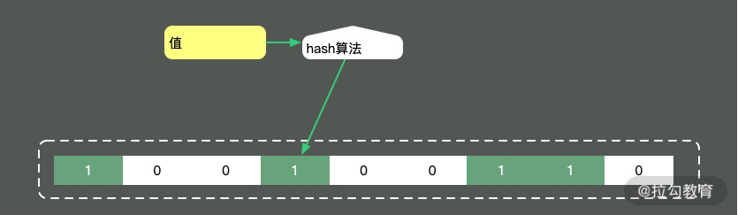

<details>
  <summary>大对象为什么会影响应用性能？</summary>
- 第一，大对象占用的资源多，垃圾回收器要花一部分精力去对它进行回收；
- 第二，大对象在不同的设备之间交换，会耗费网络流量，以及昂贵的 I/O；
- 第三，对大对象的解析和处理操作是耗时的，对象职责不聚焦，就会承担额外的性能开销。
</details>

## String的substring方法

String 在 Java 中是不可变的，如果你改动了其中的内容，它就会生成一个新的字符串。

JDK6的substring内存泄漏问题，如果你创建了比较大的对象，并基于这个对象生成了一些其他的信息，这个时候，一定要记得去掉和这个大对象的引用关系。

## 集合大对象扩容

StringBuilder、StringBuffer、HashMap，ArrayList 等。概括来讲，Java 的集合，包括 List、Set、Queue、Map 等，其中的数据都不可控。
在容量不足的时候，都会有扩容操作，扩容操作需要重新组织数据，所以都不是线程安全的。

StringBuilder扩容：

```java
void expandCapacity(int minimumCapacity) {
    int newCapacity = value.length * 2 + 2;
    if (newCapacity - minimumCapacity < 0)
        newCapacity = minimumCapacity;
    if (newCapacity < 0) {
        if (minimumCapacity < 0) // overflow 
            throw new OutOfMemoryError();
        newCapacity = Integer.MAX_VALUE;
    }
    value = Arrays.copyOf(value, newCapacity);
}
```

HashMap扩容：

```java
void addEntry(int hash, K key, V value, int bucketIndex) {
    if ((size >= threshold) && (null != table[bucketIndex])) {
        resize(2 * table.length);
        hash = (null != key) ? hash(key) : 0;
        bucketIndex = indexFor(hash, table.length);
    }
    createEntry(hash, key, value, bucketIndex);
}

void resize(int newCapacity) {
    Entry[] oldTable = table;
    int oldCapacity = oldTable.length;
    if (oldCapacity == MAXIMUM_CAPACITY) {
        threshold = Integer.MAX_VALUE;
        return;
    }
    Entry[] newTable = new Entry[newCapacity];
    transfer(newTable, initHashSeedAsNeeded(newCapacity));
    table = newTable;
    threshold = (int) Math.min(newCapacity * loadFactor, MAXIMUM_CAPACITY + 1);
}
```

## 保持合适的对象粒度

redis key原始设计：

```yaml
type: string
key: user_${userid}
value: json
```

这样的设计有两个问题：

- 查询其中某个字段的值，需要把所有 json 数据查询出来，并自行解析；
- 更新其中某个字段的值，需要更新整个 json 串，代价较高。

针对这种大粒度 json 信息，就可以采用打散的方式进行优化，使得每次更新和查询，都有聚焦的目标。

```yaml
type: hash
key: user_${userid}
value: { sex:f, id:1223, age:23 }
```

使用 hget 命令，或者 hmget 命令，就可以获取到想要的数据，加快信息流转的速度。

## Bitmap把对象变小

在 Java 虚拟机规范里，描述是：将 Boolean 类型映射成的是 1 和 0 两个数字，它占用的空间是和 int 相同的 32 位。即使有的虚拟机实现把
Boolean 映射到了 byte 类型上，它所占用的空间，对于大量的、有规律的 Boolean 值来说，也是太大了。

```java
int a = 0b0001_0001_1111_1101_1001_0001_1111_1101;
```

Bitmap 就是使用 Bit 进行记录的数据结构，里面存放的数据不是 0 就是 1。

100 亿的 Boolean 值，只需要 128MB 的内存，下面既是一个占用了 256MB 的用户性别的判断逻辑，可以涵盖长度为 100 亿的 ID。

**给出一个 1GB 内存的机器，提供 60亿 int 数据，如何快速判断有哪些数据是重复的？**

Bitmap 是一个比较底层的结构，在它之上还有一个叫作布隆过滤器的结构（Bloom Filter），布隆过滤器可以判断一个值不存在，或者可能存在。



相比较 Bitmap，它多了一层 hash 算法。既然是 hash 算法，就会有冲突，所以有可能有多个值落在同一个 bit 上。它不像
HashMap一样，使用链表或者
红黑树来处理冲突，而是直接将这个hash槽重复使用。从这个特性我们能够看出，布隆过滤器能够明确表示一个值不在集合中，但无法判断一个值确切的在集合中。

## 数据的冷热分离

时间维度：对时间维度的优化，最有效的方式就是**冷热分离**
热数据：靠近用户的，被频繁使用的数据
冷数据：访问频率非常低，年代非常久远的数据

数据冷热分离的方案：

### 1.数据双写

把对冷热库的插入、更新、删除操作，全部放在一个统一的事务里面。由于热库（比如 MySQL）和冷库（比如 Hbase）的类型不同，这个事务大概率会是分布
式事务。在项目初期，这种方式是可行的，但如果是改造一些遗留系统，分布式事务基本上是改不动的，我通常会把这种方案直接废弃掉。

### 2.写入MQ分发

通过 MQ 的发布订阅功能，在进行数据操作的时候，先不落库，而是发送到 MQ 中。单独启动消费进程，将 MQ 中的数据分别落到冷库、热库中。使用这种方
式改造的业务，逻辑非常清晰，结构也比较优雅。像订单这种结构比较清晰、对顺序性要求较低的系统，就可以采用 MQ 分发的方式。但如果你的数据库实体量
非常大，用这种方式就要考虑程序的复杂性了。

### 3.使用Binlog同步

针对 MySQL，就可以采用 Binlog 的方式进行同步，使用 Canal 组件，可持续获取最新的 Binlog 数据，结合 MQ，可以将数据同步到其他的数据源中。

## 思维发散

对于结果集的操作，我们可以再发散一下思维。可以将一个简单冗余的结果集，改造成复杂高效的数据结构。这个复杂的数据结构可以代理我们的请求，有效地转移耗时操作。

比如，我们常用的数据库索引，就是一种对数据的重新组织、加速。
B+ tree 可以有效地减少数据库与磁盘交互的次数，它通过类似 B+ tree 的数据结构，将最常用的数据进行索引，存储在有限的存储空间中。

还有就是，在 RPC 中常用的序列化。
有的服务是采用的 SOAP 协议的 WebService，它是基于 XML 的一种协议，内容大传输慢，效率低下。现在的 Web 服务中，大多数是使用
json 数据进行交互的，json 的效率相比 SOAP 就更高一些。

另外，大家应该都听过 google 的 protobuf，由于它是二进制协议，而且对数据进行了压缩，性能是非常优越的。protobuf 对数据压缩后，大小只有
json 的 1/10，xml 的 1/20，但是性能却提高了 5-100 倍。

protobuf 的设计是值得借鉴的，它通过 tag|leng|value 三段对数据进行了非常紧凑的处理，解析和传输速度都特别快。