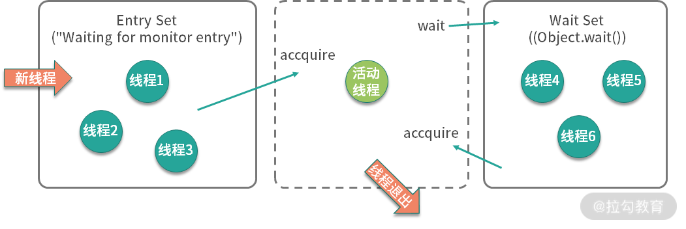
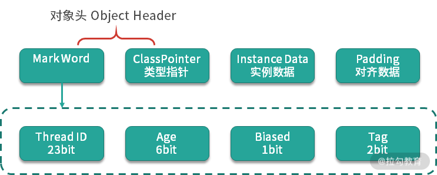

其实锁对性能的影响，是非常大的。因为对资源加锁以后，资源就被加锁的线程独占，其他的线程就只能排队等待这个锁，此时程序由并行执行，变相地成了顺序执行，执行速度自然就降低了。

我们都知道，Java 中有两种加锁的方式：一种就是常见的synchronized 关键字，另外一种，就是使用 concurrent 包里面的
Lock。针对这两种锁，JDK 自身做了很多的优化，它们的实现方式也是不同的。本课时将从这两种锁讲起，看一下对锁的一些优化方式。

## synchronized

synchronized 关键字给代码或者方法上锁时，都有显示或者隐藏的上锁对象。当一个线程试图访问同步代码块时，它首先必须得到锁，而退出或抛出异常时必须释放锁。

- 给普通方法加锁时，上锁的对象是this；
- 给静态方法加锁时，锁的对象是class对象；
- 给代码块加锁，可以指定一个具体的对象作为锁；

### 1.monitor原理

参照下面的代码，在命令行执行 javac，然后再执行 javap -v -p，就可以看到它具体的字节码。

```text
synchronized void syncMethod() {
        System.out.println("syncMethod");
}
// ======字节码=====
synchronized void syncMethod();
    descriptor: ()V
    flags: ACC_SYNCHRONIZED
    Code:
      stack=2, locals=1, args_size=1
         0: getstatic     #4
         3: ldc           #5
         5: invokevirtual #6
         8: return
```

可以看到，在字节码的体现上，它只给方法加了一个 flag：ACC_SYNCHRONIZED。

```text
void syncBlock(){
    synchronized (Test.class){
    }
}
//======字节码======
void syncBlock();
    descriptor: ()V
    flags:
    Code:
      stack=2, locals=3, args_size=1
         0: ldc           #2 
         2: dup
         3: astore_1
         4: monitorenter
         5: aload_1
         6: monitorexit
         7: goto          15
        10: astore_2
        11: aload_1
        12: monitorexit
        13: aload_2
        14: athrow
        15: return
      Exception table:
         from    to  target type
             5     7    10   any
            10    13    10   any
```

再来看下同步代码块的字节码。可以看到，字节码是通过 monitorenter 和monitorexit 两个指令进行控制的。两者虽然显示效果不同，但他们都是通过
monitor 来实现同步的。我们可以通过下面这张图，来看一下 monitor 的原理。



如上图所示，我们可以把运行时的对象锁抽象地分成三部分。其中，EntrySet 和 WaitSet 是两个队列，中间虚线部分是当前持有锁的线程，我们可以想象一下线程的执行过程。

当第一个线程到来时，发现并没有线程持有对象锁，它会直接成为活动线程，进入 RUNNING 状态。

接着又来了三个线程，要争抢对象锁。此时，这三个线程发现锁已经被占用了，就先进入 EntrySet 缓存起来，进入 BLOCKED 状态。此时，从
jstack 命令，可以看到他们展示的信息都是 waiting for monitor entry。

```text
"http-nio-8084-exec-120" #143 daemon prio=5 os_prio=31 cpu=122.86ms elapsed=317.88s tid=0x00007fedd8381000 nid=0x1af03 waiting for monitor entry  [0x00007000150e1000]
   java.lang.Thread.State: BLOCKED (on object monitor)
    at java.io.BufferedInputStream.read(java.base@13.0.1/BufferedInputStream.java:263)
    - waiting to lock <0x0000000782e1b590> (a java.io.BufferedInputStream)
    at org.apache.commons.httpclient.HttpParser.readRawLine(HttpParser.java:78)
    at org.apache.commons.httpclient.HttpParser.readLine(HttpParser.java:106)
    at org.apache.commons.httpclient.HttpConnection.readLine(HttpConnection.java:1116)
    at org.apache.commons.httpclient.HttpMethodBase.readStatusLine(HttpMethodBase.java:1973)
    at org.apache.commons.httpclient.HttpMethodBase.readResponse(HttpMethodBase.java:1735)
```

处于活动状态的线程，执行完毕退出了；或者由于某种原因执行了 wait 方法，释放了对象锁，进入了 WaitSet 队列，这就是在调用 wait
之前，需要先获得对象锁的原因。

就像下面的代码：

```text
synchronized (lock){
    try {
         lock.wait();
    } catch (InterruptedException e) {
        e.printStackTrace();
    }
}
```

此时，jstack 显示的线程状态是 WAITING 状态，而原因是 in Object.wait()。

```text
"wait-demo" #12 prio=5 os_prio=31 cpu=0.14ms elapsed=12.58s tid=0x00007fb66609e000 nid=0x6103 in Object.wait()  [0x000070000f2bd000]
   java.lang.Thread.State: WAITING (on object monitor)
    at java.lang.Object.wait(java.base@13.0.1/Native Method)
    - waiting on <0x0000000787b48300> (a java.lang.Object)
    at java.lang.Object.wait(java.base@13.0.1/Object.java:326)
    at WaitDemo.lambda$main$0(WaitDemo.java:7)
    - locked <0x0000000787b48300> (a java.lang.Object)
    at WaitDemo$$Lambda$14/0x0000000800b44840.run(Unknown Source)
    at java.lang.Thread.run(java.base@13.0.1/Thread.java:830)
```

发生了这两种情况，都会造成对象锁的释放，进而导致 EntrySet 里的线程重新争抢对象锁，成功抢到锁的线程成为活动线程，这是一个循环的过程。

那 WaitSet 中的线程是如何再次被激活的呢？接下来，在某个地方，执行了锁的 **notify** 或者 **notifyAll** 命令，会造成 WaitSet
中的线程，转移到 EntrySet 中，重新进行锁的争夺。

如此周而复始，线程就可按顺序排队执行。

### 2.分级锁

在 JDK 1.8 中，synchronized 的速度已经有了显著的提升，它都做了哪些优化呢？答案就是分级锁。JVM 会根据使用情况，对 synchronized
的锁，进行升级，它大体可以按照下面的路径进行升级：偏向锁 — 轻量级锁 — 重量级锁。

锁只能升级，不能降级，所以一旦升级为重量级锁，就只能依靠操作系统进行调度。

要想了解锁升级的过程，需要先看一下对象在内存里的结构。



如上图所示，对象分为 MarkWord、Class Pointer、Instance Data、Padding 四个部分。

和锁升级关系最大的就是 MarkWord，它的长度是 24 位，我们着重介绍一下。它包含Thread
ID（23bit）、Age（6bit）、Biased（1bit）、Tag（2bit） 四个部分，锁升级就是靠判断 Thread Id、Biased、Tag 等三个变量值来进行的。

#### 偏向锁

在只有一个线程使用了锁的情况下，偏向锁能够保证更高的效率。

具体过程是这样的：当第一个线程第一次访问同步块时，会先检测对象头 Mark Word 中的标志位 Tag 是否为
01，以此判断此时对象锁是否处于无锁状态或者偏向锁状态（匿名偏向锁）。

01 也是锁默认的状态，线程一旦获取了这把锁，就会把自己的线程 ID 写到 MarkWord 中，在其他线程来获取这把锁之前，锁都处于偏向锁状态。

当下一个线程参与到偏向锁竞争时，会先判断 MarkWord 中保存的线程 ID 是否与这个线程 ID 相等，**如果不相等，会立即撤销偏向锁，升级为轻量级锁
**。

#### 轻量级锁

轻量级锁的获取是怎么进行的呢？它们使用的是自旋方式。

参与竞争的每个线程，会在自己的线程栈中生成一个 LockRecord ( LR )，然后每个线程通过 CAS（自旋）的方式，将锁对象头中的 MarkWord
设置为指向自己的 LR 的指针，哪个线程设置成功，就意味着哪个线程获得锁。

当锁处于轻量级锁的状态时，就不能够再通过简单地对比 Tag 的值进行判断，每次对锁的获取，都需要通过自旋。

当然，自旋也是面向不存在锁竞争的场景，比如一个线程运行完了，另外一个线程去获取这把锁；**但如果自旋失败达到一定的次数，锁就会膨胀为重量级锁
**。

#### 重量级锁

重量级锁，即我们对 synchronized 的直观认识，这种情况下，线程会挂起，进入到操作系统内核态，等待操作系统的调度，然后再映射回用户态。系统调用是昂贵的，所以重量级锁的名称由此而来。

如果系统的共享变量竞争非常激烈，锁会迅速膨胀到重量级锁，这些优化就名存实亡。如果并发非常严重，可以通过参数 -XX:
-UseBiasedLocking 禁用偏向锁，理论上会有一些性能提升，但实际上并不确定。

## Lock

在 concurrent 包里，我们能够发现 ReentrantLock 和 ReentrantReadWriteLock 两个类。Reentrant 就是可重入的意思，它们和
synchronized 关键字一样，都是可重入锁。

这里有必要解释一下“可重入”这个概念，这是一个面试高频考点。它的意思是，一个线程运行时，可以多次获取同一个对象锁，这是因为 Java
的锁是基于线程的，而不是基于调用的。

比如下面这段代码，由于方法 a、b、c 锁的都是当前的 this，线程在调用 a 方法的时候，就不需要多次获取对象锁。

```java
public synchronized void a() {
    b();
}

public synchronized void b() {
    c();
}

public synchronized void c() {
}
```

### 1.主要方法

Lock 是基于 AQS（AbstractQueuedSynchronizer）实现的，而 AQS 是基于 volitale 和 CAS 实现的。Lock 与 synchronized
的使用方法不同，它需要手动加锁，然后在 finally 中解锁。Lock 接口比 synchronized 灵活性要高，我们来看一下几个关键方法。

- Lock： Lock 方法和 synchronized 没什么区别，如果获取不到锁，都会被阻塞；
- tryLock： 此方法会尝试获取锁，不管能不能获取到锁，都会立即返回，不会阻塞，它是有返回值的，获取到锁就会返回 true；
- tryLock(long time, TimeUnit unit)： 与 tryLock 类似，但它在拿不到锁的情况下，会等待一段时间，直到超时；
- LockInterruptibly： 与 Lock 类似，但是可以锁等待，可以被中断，中断后返回 InterruptedException；

一般情况下，使用 Lock 方法就可以；但如果业务请求要求响应及时，那使用带超时时间的tryLock是更好的选择：我们的业务可以直接返回失败，而不用进行阻塞等待。tryLock
这种优化手段，采用降低请求成功率的方式，来保证服务的可用性，在高并发场景下常被高频采用。

### 2.读写锁

对于有些业务来说，使用 Lock 这种粗粒度的锁还是太慢了。比如，对于一个HashMap
来说，某个业务是读多写少的场景，这个时候，如果给读操作，也加上和写操作一样的锁的话，效率就会很慢。

ReentrantReadWriteLock 是一种读写分离的锁，它允许多个读线程同时进行，但读和写、写和写是互斥的。

使用方法如下所示，分别获取读写锁，对写操作加写锁，对读操作加读锁，并在 finally 里释放锁即可。

```java
ReentrantReadWriteLock lock = new ReentrantReadWriteLock();
Lock readLock = lock.readLock();
Lock writeLock = lock.writeLock();

public void put(K k, V v) {
    writeLock.lock();
    try {
        map.put(k, v);
    } finally {
        writeLock.unlock();
    }
}
...

```

### 3.公平锁与非公平锁

#### 非公平锁

我们平常用到的锁，都是非公平锁，可以回过头来看一下 monitor 的原理。当持有锁的线程释放锁的时候，EntrySet
里的线程就会争抢这把锁，这个争抢过程，是随机的，也就是说你并不知道哪个线程会获取对象锁，谁抢到了就算谁的。

这就有一定的概率会发生，某个线程总是抢不到锁的情况。比如，某个线程通过 setPriority
设置得比较低的优先级，这个抢不到锁的线程，就一直处于饥饿状态，这就是线程饥饿的概念。

#### 公平锁

而公平锁通过把随机变成有序，可以解决这个问题，synchronized 没有这个功能，在Lock 中可以通过构造参数设置成公平锁，代码如下：

```java
public ReentrantReadWriteLock(boolean fair) {
    sync = fair ? new FairSync() : new NonfairSync();
    readerLock = new ReadLock(this);
    writerLock = new WriteLock(this);
}
```

由于所有的线程都需要排队，需要在多核的场景下维护一个同步队列，在多个线程争抢锁的时候，吞吐量就很低。
下面是 20 个并发之下，锁的 JMH 测试结果，可以看到，非公平锁比公平锁的性能高出两个数量级。

```text
Benchmark                      Mode  Cnt      Score      Error   Units
FairVSNoFairBenchmark.fair    thrpt   10    186.144 ±   27.462  ops/ms
FairVSNoFairBenchmark.nofair  thrpt   10  35195.649 ± 6503.375  ops/ms
```

## 锁的优化技巧

### 1.死锁

锁冲突最严重的一种情况：死锁。下面这段示例代码，两个线程分别持有对方所需要的锁，并进入了相互等待的状态，那么它们就进入了死锁。

```java
public class DeadLockDemo {
    public static void main(String[] args) {
        Object object1 = new Object();
        Object object2 = new Object();
        Thread t1 = new Thread(() -> {
            synchronized (object1) {
                try {
                    Thread.sleep(200);
                } catch (InterruptedException e) {
                    e.printStackTrace();
                }
                synchronized (object2) {
                }
            }
        }, "deadlock-demo-1");

        t1.start();
        Thread t2 = new Thread(() -> {
            synchronized (object2) {
                try {
                    Thread.sleep(200);
                } catch (InterruptedException e) {
                    e.printStackTrace();
                }
                synchronized (object1) {
                }
            }
        }, "deadlock-demo-2");
        t2.start();
    }
}
```

代码创建了两把对象锁，线程1 首先拿到了 object1 的对象锁，200ms 后尝试获取 object2 的对象锁。但这个时候，object2 的对象锁已经被线程2
获取了。这两个线程进入了相互等待的状态，产生了死锁。

使用我们上面提到的，带超时时间的 tryLock 方法，有一方超时让步，可以一定程度上避免死锁。

### 2.优化技巧

锁的优化理论其实很简单，那就是**减少锁的冲突**。无论是锁的读写分离，还是分段锁，本质上都是为了**避免多个线程同时获取同一把锁。
**

总结一下优化的一般思路：减少锁的粒度、减少锁持有的时间、锁分级、锁分离 、锁消除、乐观锁、无锁等。

@startmindmap

* 锁优化
  ** 减少锁的粒度
  ** 减少锁持有时间
  ** 锁分级
  ** 锁分离

left side

** 锁消除
** 乐观锁
** 无锁
@endmindmap

#### 减少锁粒度

通过减小锁的粒度，可以将冲突分散，减少冲突的可能，从而提高并发量。简单来说，就是把资源进行抽象，针对每类资源使用**单独的锁进行保护
**。

比如下面的代码，由于 list 1 和 list 2 属于两类资源，就没必要使用同一个对象锁进行处理。

```java
public class LockLessDemo {
    List<String> list1 = new ArrayList<>();
    List<String> list2 = new ArrayList<>();

    public synchronized void addList1(String v) {
        this.list1.add(v);
    }

    public synchronized void addList2(String v) {
        this.list2.add(v);
    }
}
```

可以创建两个不同的锁，改善情况如下：

```java
public class LockLessDemo {
    List<String> list1 = new ArrayList<>();
    List<String> list2 = new ArrayList<>();
    final Object lock1 = new Object();
    final Object lock2 = new Object();

    public void addList1(String v) {
        synchronized (lock1) {
            this.list1.add(v);
        }
    }

    public void addList2(String v) {
        synchronized (lock2) {
            this.list2.add(v);
        }
    }
}
```

#### 减少锁持有时间

通过让锁资源尽快地释放，减少锁持有的时间，其他线程可更迅速地获取锁资源，进行其他业务的处理。

考虑到下面的代码，由于 slowMethod 不在锁的范围内，占用的时间又比较长，可以把它移动到 Synchronized 代码块外面，加速锁的释放。

```java
public class LockTimeDemo {
    List<String> list = new ArrayList<>();
    final Object lock = new Object();

    public void addList(String v) {
        synchronized (lock) {
            slowMethod();
            this.list.add(v);
        }
    }

    public void slowMethod() {
    }
}
```

#### 锁分级

锁分级，指的是我们文章开始讲解的 Synchronied 锁的锁升级，属于 JVM 的内部优化，它从偏向锁开始，逐渐升级为轻量级锁、重量级锁，这个过程是不可逆的。

#### 锁分离

我们在上面提到的读写锁，就是锁分离技术。这是因为，读操作一般是不会对资源产生影响的，可以并发执行；写操作和其他操作是互斥的，只能排队执行。所以读写锁适合读多写少的场景。

#### 锁消除

通过 JIT 编译器，JVM 可以消除某些对象的加锁操作。举个例子，大家都知道StringBuffer 和 StringBuilder 都是做字符串拼接的，而且前者是线程安全的。

但其实，如果这两个字符串拼接对象用在函数内，JVM 通过逃逸分析这个对象的作用范围就是在本函数中，就会把锁的影响给消除掉。

比如下面这段代码，它和 StringBuilder 的效果是一样的。

```java
String m1() {
    StringBuffer sb = new StringBuffer();
    sb.append("");
    return sb.toString();
}
```

当然，对于读多写少的互联网场景，最有效的做法，是**使用乐观锁，甚至无锁**，这部分我们会在下一课时《14 | 案例分析：乐观锁和无锁》中介绍。

## 小结

Java 中有两种加锁方式：一种是使用 Synchronized 关键字，另外一种是 concurrent 包下面的 Lock。

本课时，我们详细地了解了它们的一些特性，包括实现原理，其对比如下：

| 类别	  | Synchronized	 | Lock              |
|------|---------------|-------------------|
| 实现方式 | monitor       | AQS               |
| 底层细节 | JVM优化         | Java API          |
| 分级锁  | 是             | 否                 |
| 功能特性 | 单一            | 丰富                |
| 锁分离  | 无             | 读写锁               |
| 锁超时  | 无             | 带超时时间的 tryLock    |
| 可中断	 | 否             | lockInterruptibly |

Lock 的功能是比 Synchronized 多的，能够对线程行为进行更细粒度的控制。

但如果只是用最简单的锁互斥功能，建议直接使用 Synchronized，有两个原因：

- Synchronized 的编程模型更加简单，更易于使用
- Synchronized 引入了偏向锁，轻量级锁等功能，能够从 JVM 层进行优化，同时JIT 编译器也会对它执行一些锁消除动作。
-

我们还了解了公平锁与非公平锁，以及可重入锁的概念，以及一些通用的优化技巧。有冲突，才会有优化空间，那么无锁队列是怎么回事呢？它又是怎么实现的呢？下一课时《14 |
案例分析：乐观锁和无锁》，我们会来解答这些问题。