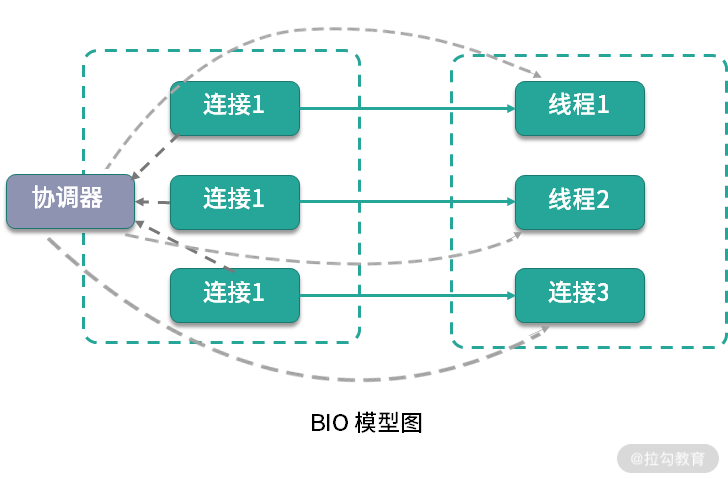

Reactor 是 NIO 的基础。为什么 NIO 的性能就能够比传统的阻塞 I/O 性能高呢？我们首先来看一下传统阻塞式 I/O 的一些特点。

## 阻塞I/O模型

## 非阻塞I/O模型

其实，在处理 I/O 动作时，有大部分时间是在等待。比如，socket 连接要花费很长时间进行连接操作，在完成连接的这段时间内，它并没有占用额外的系统
资源，但它只能阻塞等待在线程中。这种情况下，系统资源并不能被合理利用。

Java 的 NIO，在 Linux 上底层是使用 epoll 实现的。epoll 是一个高性能的多路复用 I/O 工具，改进了 select 和 poll 等工具的一些功能。在网
络编程中，对 epoll 概念的一些理解，几乎是面试中必问的问题。

